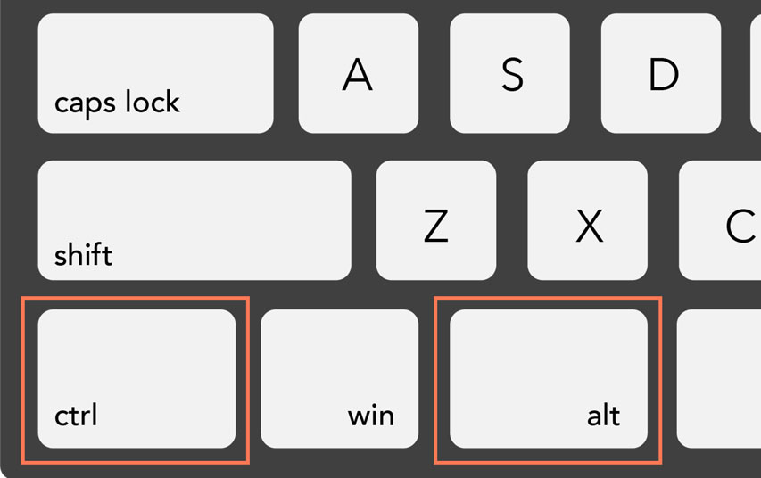
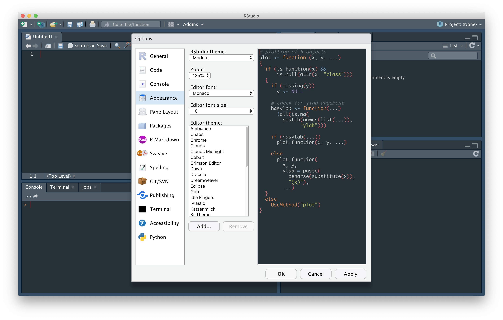
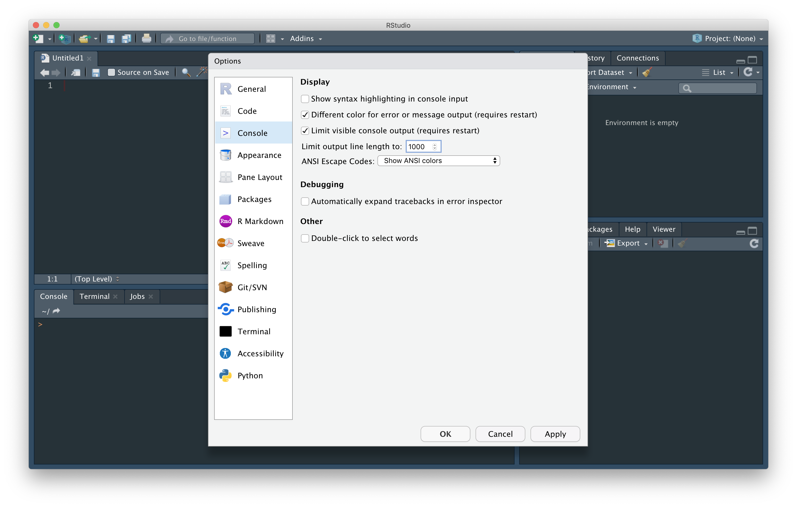

```{r setup, include=FALSE}
options(htmltools.dir.version = FALSE)
knitr::opts_chunk$set(
  fig.width = 9, fig.height = 3.5, fig.retina = 3,
  out.width = "100%",
  cache = FALSE,
  echo = TRUE,
  message = FALSE, 
  warning = FALSE,
  hiline = TRUE
)
```

```{r xaringan-themer, include = FALSE, warning = FALSE}
# load packages
library(xaringanthemer)
library(tidyverse)
library(kableExtra)

# set accent theme
style_mono_accent(
  header_font_google = google_font("Nunito Sans"), # Sanchez
  text_font_google = google_font("Glacial Indifference", "300", "300i"),
  code_font_google = google_font("Fira Code"),
  base_color = "#05859B",
  white_color = "#93C6C2", 
  background_color = "#FFFFFF",
  link_color = "#9b0546",
  text_bold_color = "#05859B",
  header_font_weight = 400,
  header_h1_font_size = "2.25rem",
  header_h2_font_size = "1.75rem",
  header_h3_font_size = "1.5rem",
  footnote_font_size = "0.7em",
)
```

class: inverse, middle

# RStudio Tips & Tricks 
### ...and other keyboard shortcuts to make you a more efficient coder `r fontawesome::fa("keyboard", fill = "#93C6C2", a11y = "sem")`<br>

<br>

<span style = 'font-size: 130%;'>Sam Csik | Data Training Coordinator</span>  

National Center for Ecological Analysis & Synthesis<br>

<br>

<span style = 'font-size: 130%;'>Masters of Environmental Data Science | Fall 2021</span>   

Slides & source code available on [`r fontawesome::fa("github", fill = "#93C6C2", a11y = "sem")`](https://github.com/UCSB-MEDS/R-tips-and-tricks)

---
## Keyboard shortcuts...are they really worth my time?

<br>
--

`r fontawesome::fa("keyboard", fill = "#05859B", a11y = "sem")` Because both your hands remain on the keyboard, shortcuts are often **faster** than a mouse

<br>
--

`r fontawesome::fa("clock", fill = "#05859B", a11y = "sem")` Yes, learning shortcuts *does* take some patience and practice, but it will **save you time** in the long run

<br>
--

`r fontawesome::fa("globe", fill = "#05859B", a11y = "sem")` Good news: lots keyboard shortcuts are **universal**, meaning you can use them across a variety applications

<br>
--

`r fontawesome::fa("mouse-pointer", fill = "#05859B", a11y = "sem")` Looking for more shortcuts? **Clicking on or hovering over** menu items/buttons in many applications will reveal the corresponding keyboard shortcut

---
## `r fontawesome::fa("gamepad", fill = "#05859B", a11y = "sem")` Make it a game

> <span style = 'font-size: 70%;'>*[shortcutFoo](https://www.shortcutfoo.com/) was created by programmers for programmers in an attempt to make learning your editor fun, easy, and effective. Akin to the days of first learning how to type on a keyboard, shortcutFoo aims to help programmers accomplish more in less time and with fewer keystrokes.*</span>

.center[
```{r, echo = FALSE, out.width='60%', out.height='60%'}
knitr::include_graphics("media/pics/shortcutFoo.jpeg")
```
]

<span style = 'font-size: 70%;'>Learn and practice shortcuts for all your favorite applications -- ranging from programming editors like RStudio and PyCharm to apps like Twitter, GitHub, and Slack. Start a new game at https://www.shortcutfoo.com/app/dojos.</span>

---
## `r fontawesome::fa("apple", fill = "#05859B", a11y = "sem")` Mac vs. `r fontawesome::fa("windows", fill = "#05859B", a11y = "sem")`  Windows

<br>

<span style = 'font-size: 90%;'>Keyboard shortcuts typically involve pressing two or more keys in a specific order. Most times, the key combos include at least one of the following: control, option, command, alt</span>

.pull-left[
```{r echo = FALSE, out.width = '110%'}
knitr::include_graphics("media/pics/mac_basics.jpeg")
```
.center[
<span style = 'font-size: 75%;'>`r fontawesome::fa("apple", fill = "#05859B", a11y = "sem")` Macs use **control**, **option**, and **command** keys</span>
]
]

.pull-right[
```{r echo = FALSE, out.width = '95%'}

```
.center[
<span style = 'font-size: 75%;'>`r fontawesome::fa("windows", fill = "#05859B", a11y = "sem")` Windows machines use the **ctrl** (Control) and **alt** keys</span>
]
]

.footnote[
Image source: https://edu.gcfglobal.org/en/techsavvy/keyboard-shortcuts/1/
]
---
class: inverse center middle

# General keyboard shortcuts

Become a keyboard ninja `r fontawesome::fa("user-ninja", fill = "#93C6C2", a11y = "sem")` across lots of your favorite applications with the stroke of a few keys

---

## `r fontawesome::fa("copy", fill = "#05859B", a11y = "sem")` Copy/Cut, Paste, Undo, Redo

.center[
```{r echo = FALSE, out.width = '70%'}
#
```
<iframe width="650" height="365" src="media/mp4/copy_cut_undo_redo.mp4" frameborder="0" allow="accelerometer; autoplay; encrypted-media; gyroscope; picture-in-picture" allowfullscreen></iframe>
]

.center[
<span style = 'font-size: 80%;'>`r fontawesome::fa("angle-right", fill = "#05859B", a11y = "sem")` copy: (`r fontawesome::fa("apple", fill = "#05859B", a11y = "sem")`)`command`/(`r fontawesome::fa("windows", fill = "#05859B", a11y = "sem")`)`control` + `C`</span>  
<span style = 'font-size: 80%;'>`r fontawesome::fa("angle-right", fill = "#05859B", a11y = "sem")` cut: (`r fontawesome::fa("apple", fill = "#05859B", a11y = "sem")`)`command`/(`r fontawesome::fa("windows", fill = "#05859B", a11y = "sem")`)`control` + `X`</span>  
<span style = 'font-size: 80%;'>`r fontawesome::fa("angle-right", fill = "#05859B", a11y = "sem")` paste: (`r fontawesome::fa("apple", fill = "#05859B", a11y = "sem")`)`command`/(`r fontawesome::fa("windows", fill = "#05859B", a11y = "sem")`)`control` + `V`</span>  
<span style = 'font-size: 80%;'>`r fontawesome::fa("angle-right", fill = "#05859B", a11y = "sem")` undo:  (`r fontawesome::fa("apple", fill = "#05859B", a11y = "sem")`)`command`/ (`r fontawesome::fa("windows", fill = "#05859B", a11y = "sem")`)`control` + `Z`</span>  
]

---

## `r fontawesome::fa("search", fill = "#05859B", a11y = "sem")` Find & `r fontawesome::fa("save", fill = "#05859B", a11y = "sem")` Save

.center[
```{r echo = FALSE, out.width = '70%'}
#
```
<iframe width="650" height="365" src="media/mp4/find_replace_save.mp4" frameborder="0" allow="accelerometer; autoplay; encrypted-media; gyroscope; picture-in-picture" allowfullscreen></iframe>
]

.center[
<span style = 'font-size: 80%;'>`r fontawesome::fa("angle-right", fill = "#05859B", a11y = "sem")` find: (`r fontawesome::fa("apple", fill = "#05859B", a11y = "sem")`)`command`/(`r fontawesome::fa("windows", fill = "#05859B", a11y = "sem")`)`control` + `F`</span>  
<span style = 'font-size: 80%;'>`r fontawesome::fa("angle-right", fill = "#05859B", a11y = "sem")` save: (`r fontawesome::fa("apple", fill = "#05859B", a11y = "sem")`)`command`/(`r fontawesome::fa("windows", fill = "#05859B", a11y = "sem")`)`control` + `S`</span>  
]

---
## `r fontawesome::fa("highlighter", fill = "#05859B", a11y = "sem")` Select Text 

.center[
```{r echo = FALSE, out.width = '70%'}
# 
```
.center[
<iframe width="650" height="365" src="media/mp4/select_text.mp4" frameborder="0" allow="accelerometer; autoplay; encrypted-media; gyroscope; picture-in-picture" allowfullscreen></iframe>
]
]

.center[
<span style = 'font-size: 80%;'>`r fontawesome::fa("angle-right", fill = "#05859B", a11y = "sem")` select all: (`r fontawesome::fa("apple", fill = "#05859B", a11y = "sem")`)`command`/ (`r fontawesome::fa("windows", fill = "#05859B", a11y = "sem")`)`control` + `A`</span>  
<span style = 'font-size: 80%;'>`r fontawesome::fa("angle-right", fill = "#05859B", a11y = "sem")` select everything in a particular direction: (`r fontawesome::fa("apple", fill = "#05859B", a11y = "sem")`)`command` + `shift` + `arrow key`</span>   
<span style = 'font-size: 80%;'>`r fontawesome::fa("angle-right", fill = "#05859B", a11y = "sem")` select everything within a set of closed `( )`: (`r fontawesome::fa("apple", fill = "#05859B", a11y = "sem")`)`control` + `shift` + `E`</span>  
<span style = 'font-size: 80%;'>`r fontawesome::fa("angle-right", fill = "#05859B", a11y = "sem")` select character-by-character: (`r fontawesome::fa("apple", fill = "#05859B", a11y = "sem")` & `r fontawesome::fa("windows", fill = "#05859B", a11y = "sem")`)`shift` + `arrow key`</span>   
]

---
## `r fontawesome::fa("step-forward", fill = "#05859B", a11y = "sem")` Jump to the beginning/end of lines

.center[
```{r echo = FALSE, out.width = '70%'}
# 
```
<iframe width="650" height="365" src="media/mp4/jump_beginning_end.mp4" frameborder="0" allow="accelerometer; autoplay; encrypted-media; gyroscope; picture-in-picture" allowfullscreen></iframe>
]

.center[
<span style = 'font-size: 80%;'>`r fontawesome::fa("angle-right", fill = "#05859B", a11y = "sem")` Jump to beginning: (`r fontawesome::fa("apple", fill = "#05859B", a11y = "sem")`)`command`/ (`r fontawesome::fa("windows", fill = "#05859B", a11y = "sem")`)`Alt` + `right arrow`</span>  
<span style = 'font-size: 80%;'>`r fontawesome::fa("angle-right", fill = "#05859B", a11y = "sem")` Jump to end: (`r fontawesome::fa("apple", fill = "#05859B", a11y = "sem")`)`command`/ (`r fontawesome::fa("windows", fill = "#05859B", a11y = "sem")`)`Alt` + `left arrow`</span>  
<span style = 'font-size: 80%;'>`r fontawesome::fa("angle-right", fill = "#05859B", a11y = "sem")` Jump one word at a time (`r fontawesome::fa("apple", fill = "#05859B", a11y = "sem")`)`option`/ (`r fontawesome::fa("windows", fill = "#05859B", a11y = "sem")`)`control` + `left/right arrow`</span>  
<span style = 'font-size: 80%;'>`r fontawesome::fa("angle-right", fill = "#05859B", a11y = "sem")` **Bonus**: begin typing a function name and RStudio will suggest functions for auto-complete</span>
]

---
## `r fontawesome::fa("arrow-left", fill = "#05859B", a11y = "sem")` `r fontawesome::fa("arrow-right", fill = "#05859B", a11y = "sem")` Changing tabs

<span style = 'font-size: 80%;'>Use this to navigate between browser tabs or open scripts/files in RStudio.</span>

.center[
```{r echo = FALSE, out.width = '70%'}
# 
```
<iframe width="700" height="415" src="media/mp4/tabs.mp4" frameborder="0" allow="accelerometer; autoplay; encrypted-media; gyroscope; picture-in-picture" allowfullscreen></iframe>
]

.center[
<span style = 'font-size: 80%;'>`r fontawesome::fa("angle-right", fill = "#05859B", a11y = "sem")` Move tabs (to the right): (`r fontawesome::fa("apple", fill = "#05859B", a11y = "sem")` & `r fontawesome::fa("windows", fill = "#05859B", a11y = "sem")`)`control` + `tab`</span>   
<span style = 'font-size: 80%;'>`r fontawesome::fa("angle-right", fill = "#05859B", a11y = "sem")` Move tabs (to the left): (`r fontawesome::fa("apple", fill = "#05859B", a11y = "sem")` & `r fontawesome::fa("windows", fill = "#05859B", a11y = "sem")`)`control` + `shift` + `tab`</span> 
]

---
class: inverse, middle, center

## R/RStudio-specific shortcuts 

Quickly write/edit code and navigate the RStudio IDE using these shortcuts

---
## RStudio Keyboard Shortcut Quick Reference

.center[
```{r echo = FALSE, out.width = '90%'}
knitr::include_graphics("media/pics/keyboard_shortcuts_ref.png")
```
]

.center[
<span style = 'font-size: 80%;'>`r fontawesome::fa("angle-right", fill = "#05859B", a11y = "sem")` Access the RStudio Keyboard Shortcut Quick Reference: (`r fontawesome::fa("apple", fill = "#05859B", a11y = "sem")`)`option`/ (`r fontawesome::fa("windows", fill = "#05859B", a11y = "sem")`)`Alt` + `shift` + `K`</span> 
]

---
## `r fontawesome::fa("code", fill = "#05859B", a11y = "sem")` Run lines of code

.center[
<iframe width="650" height="365" src="media/mp4/run_code.mp4" frameborder="0" allow="accelerometer; autoplay; encrypted-media; gyroscope; picture-in-picture" allowfullscreen></iframe>
]

.center[
<span style = 'font-size: 80%;'>`r fontawesome::fa("angle-right", fill = "#05859B", a11y = "sem")` Run selected line(s): (`r fontawesome::fa("apple", fill = "#05859B", a11y = "sem")`)`command`/ (`r fontawesome::fa("windows", fill = "#05859B", a11y = "sem")`)`control` + (`r fontawesome::fa("apple", fill = "#05859B", a11y = "sem")`)`return`/(`r fontawesome::fa("windows", fill = "#05859B", a11y = "sem")`)`enter`</span>  
<span style = 'font-size: 80%;'>`r fontawesome::fa("angle-right", fill = "#05859B", a11y = "sem")` Run line(s) without moving cursor: (`r fontawesome::fa("apple", fill = "#05859B", a11y = "sem")`)`option`/ (`r fontawesome::fa("windows", fill = "#05859B", a11y = "sem")`)`alt` + (`r fontawesome::fa("apple", fill = "#05859B", a11y = "sem")`)`return`/(`r fontawesome::fa("windows", fill = "#05859B", a11y = "sem")`)`enter`</span>
]

---
## `r fontawesome::fa("file-code", fill = "#05859B", a11y = "sem")` Insert code chunk

.center[
<iframe width="650" height="365" src="media/mp4/insert_code_chunk.mp4" frameborder="0" allow="accelerometer; autoplay; encrypted-media; gyroscope; picture-in-picture" allowfullscreen></iframe>
]

.center[
<span style = 'font-size: 80%;'>`r fontawesome::fa("angle-right", fill = "#05859B", a11y = "sem")` Insert code chunk (into an RMarkdown file): (`r fontawesome::fa("apple", fill = "#05859B", a11y = "sem")`)`command`/ (`r fontawesome::fa("windows", fill = "#05859B", a11y = "sem")`)`control` + (`r fontawesome::fa("apple", fill = "#05859B", a11y = "sem")`)`option`/(`r fontawesome::fa("windows", fill = "#05859B", a11y = "sem")`)`alt` + `I`</span>
]

---
## `r fontawesome::fa("arrow-left", fill = "#05859B", a11y = "sem")` Operators & `r fontawesome::fa("hashtag", fill = "#05859B", a11y = "sem")` Commenting Out Code

.center[
<iframe width="650" height="365" src="media/mp4/operators_comment.mp4" frameborder="0" allow="accelerometer; autoplay; encrypted-media; gyroscope; picture-in-picture" allowfullscreen></iframe>
]

.center[
<span style = 'font-size: 80%;'>`r fontawesome::fa("angle-right", fill = "#05859B", a11y = "sem")` {magrittr} pipe operator (`%>%`): (`r fontawesome::fa("apple", fill = "#05859B", a11y = "sem")` & `r fontawesome::fa("windows", fill = "#05859B", a11y = "sem")`)`control` + `shift` + `M`</span>  
<span style = 'font-size: 80%;'>`r fontawesome::fa("angle-right", fill = "#05859B", a11y = "sem")` assignment arrow (`<-`): (`r fontawesome::fa("apple", fill = "#05859B", a11y = "sem")`)`option`/(`r fontawesome::fa("windows", fill = "#05859B", a11y = "sem")`)`alt` + `-`</span>  
<span style = 'font-size: 80%;'>`r fontawesome::fa("angle-right", fill = "#05859B", a11y = "sem")` comment/uncomment code: (`r fontawesome::fa("apple", fill = "#05859B", a11y = "sem")`)`command`/(`r fontawesome::fa("windows", fill = "#05859B", a11y = "sem")`)`control` + `shift` + `C`</span> 
]

---
## `r fontawesome::fa("file-alt", fill = "#05859B", a11y = "sem")` Look up function documentation

.center[
<iframe width="650" height="365" src="media/mp4/F1_function.mp4" frameborder="0" allow="accelerometer; autoplay; encrypted-media; gyroscope; picture-in-picture" allowfullscreen></iframe>
]

.center[
<span style = 'font-size: 80%;'>`r fontawesome::fa("angle-right", fill = "#05859B", a11y = "sem")` Look up function documentation for a highlighted function: (`r fontawesome::fa("apple", fill = "#05859B", a11y = "sem")` & `r fontawesome::fa("windows", fill = "#05859B", a11y = "sem")`)`Fn` + `F1`</span> 
]

.footnote[
<span style = 'font-size: 70%;'>Windows users: If your `Fn` key is not working, look for an `Fn lock` button (often shared with the `Esc` key). Press `Fn` + `Fn lock` to unlock the F row. Then use `Fn` + `F1` to look up function documentation.</span> 
]

---
## Function creation shortcut (extract function)

.center[
<iframe width="650" height="365" src="media/mp4/function_creation.mp4" frameborder="0" allow="accelerometer; autoplay; encrypted-media; gyroscope; picture-in-picture" allowfullscreen></iframe>
]

.center[
<span style = 'font-size: 80%;'>`r fontawesome::fa("angle-right", fill = "#05859B", a11y = "sem")` Quickly create a function from existing arguments: `control` + (`r fontawesome::fa("apple", fill = "#05859B", a11y = "sem")`)`option`/(`r fontawesome::fa("windows", fill = "#05859B", a11y = "sem")`)`alt` + `X`</span> 
]

---
## Variable creation shortcut (extract variable)

.center[
<iframe width="650" height="365" src="media/mp4/extract_variable.mp4" frameborder="0" allow="accelerometer; autoplay; encrypted-media; gyroscope; picture-in-picture" allowfullscreen></iframe>
]

.center[
<span style = 'font-size: 80%;'>`r fontawesome::fa("angle-right", fill = "#05859B", a11y = "sem")` Quickly assign an object to a variable name: `control` + (`r fontawesome::fa("apple", fill = "#05859B", a11y = "sem")`)`option`/(`r fontawesome::fa("windows", fill = "#05859B", a11y = "sem")`)`alt` + `V`</span> 
]

---
## `r fontawesome::fa("i-cursor", fill = "#05859B", a11y = "sem")` Multi-line cursor

.center[
<iframe width="650" height="365" src="media/mp4/multiple_cursors.mp4" frameborder="0" allow="accelerometer; autoplay; encrypted-media; gyroscope; picture-in-picture" allowfullscreen></iframe>
]

.center[
<span style = 'font-size: 80%;'>`r fontawesome::fa("angle-right", fill = "#05859B", a11y = "sem")` Hold (`r fontawesome::fa("apple", fill = "#05859B", a11y = "sem")`)`option`/(`r fontawesome::fa("windows", fill = "#05859B", a11y = "sem")`)`alt` + drag in the direction you want to stretch your cursor</span>
]

---
## `r fontawesome::fa("align-left", fill = "#05859B", a11y = "sem")` Align messy code (reformat code)

`command` + `shift` + `A`

---
## `r fontawesome::fa("compress-alt", fill = "#05859B", a11y = "sem")` Code snippets

<span style = 'font-size: 75%;'>Code snippets allow you to more quickly produce code by typing an abbreviated version of a function, which RStudio then auto-completes and/or fills in placeholders for the necessary arguments. You can check out all default code snippets by navigating to **Tools** -> **Global Options** -> **Code** -> **Edit Snippets...**. To use a snippet, type its *keyword* (you see a pop up that denotes the keyword as a `{snippet}`), then *tab* to auto-complete. Use the *tab* key to move across and fill in any text placeholders.</span>

.center[
<iframe width="700" height="415" src="media/mp4/snippets.mp4" frameborder="0" allow="accelerometer; autoplay; encrypted-media; gyroscope; picture-in-picture" allowfullscreen></iframe>
]

---
## `r fontawesome::fa("compress-alt", fill = "#05859B", a11y = "sem")` Adding custom code snippets

<span style = 'font-size:75%;'>You can create your own custom code snippets by adding them to the **Edit Snippets...** editor. The structure of a snippet is as follows:</span>

```{r, eval = FALSE, echo = TRUE}
snippet keyword
  function(${1:input1}, ${2:input2}, ${N:inputN})
```

<span style = 'font-size:75%;'>`$` denotes where the cursor should jump after completing each section of a snippet. Read more about how to customize code snippets [here](https://support.rstudio.com/hc/en-us/articles/204463668-Code-Snippets?version=1.4.1103&mode=desktop).</span>

.center[
<iframe width="600" height="315" src="media/mp4/custom_snippet.mp4" frameborder="0" allow="accelerometer; autoplay; encrypted-media; gyroscope; picture-in-picture" allowfullscreen></iframe>
]

---
## `r fontawesome::fa("power-off", fill = "#05859B", a11y = "sem")` Restart R 

command + shift + Fn + F10
ctrl + shift + Fn + F10

---
class: inverse, middle, center

## Customize your RStudio IDE experience

The RStudio IDE makes using `r fontawesome::fa("r-project", fill = "#93C6C2", a11y = "sem")` a whole lot easier (and more fun). We will explore some of the many ways you can customize your RStudio IDE.

---
## RStudio Appearance 

<span style = 'font-size: 75%;'>Change the appearance of RStudio by choosing **Tools** -> **Global Options** -> **Appearance** and try out different options from the **Editor font**, **Editor font size**, and **Editor theme** drop downs.</span>

.center[
```{r, echo = FALSE, eval = TRUE, out.width = '90%'}

```
]

---
## Rearrange Pane Layout

<span style = 'font-size: 75%;'>Change the pane layout (and add additional panes!) by choosing **Tools** -> **Global Options** -> **Pane Layout** and select what you would like in each RStudio quadrant. </span>

.center[
```{r, echo = FALSE, eval = TRUE, out.width = '90%'}
knitr::include_graphics("media/pics/panels.png")
```
]

---
## `r fontawesome::fa("window-minimize", fill = "#05859B", a11y = "sem")``r fontawesome::fa("window-maximize", fill = "#05859B", a11y = "sem")` Maximize panes

.center[
<iframe width="600" height="315" src="media/mp4/RStudio_window_panes.mp4" frameborder="0" allow="accelerometer; autoplay; encrypted-media; gyroscope; picture-in-picture" allowfullscreen></iframe>
]

.center[
<span style = 'font-size: 70%;'>`r fontawesome::fa("angle-right", fill = "#05859B", a11y = "sem")` Maximize source editor (script): (`r fontawesome::fa("apple", fill = "#05859B", a11y = "sem")` & `r fontawesome::fa("windows", fill = "#05859B", a11y = "sem")`)`control` + `shift` + `1`</span>   
<span style = 'font-size: 70%;'>`r fontawesome::fa("angle-right", fill = "#05859B", a11y = "sem")` Maximize console: (`r fontawesome::fa("apple", fill = "#05859B", a11y = "sem")` & `r fontawesome::fa("windows", fill = "#05859B", a11y = "sem")`)`control` + `shift` + `2`</span>   
<span style = 'font-size: 70%;'>`r fontawesome::fa("angle-right", fill = "#05859B", a11y = "sem")` Maximize plot window: (`r fontawesome::fa("apple", fill = "#05859B", a11y = "sem")` & `r fontawesome::fa("windows", fill = "#05859B", a11y = "sem")`)`control` + `shift` + `6`</span>   
<span style = 'font-size: 70%;'>`r fontawesome::fa("angle-right", fill = "#05859B", a11y = "sem")` Return to four pane view: (`r fontawesome::fa("apple", fill = "#05859B", a11y = "sem")` & `r fontawesome::fa("windows", fill = "#05859B", a11y = "sem")`)`control` + `shift` + `0`</span> 
]

.footnote[
<span style = 'font-size: 65%;'>Move your cursor to different panes (but not maximize that pane) by using the same key combinations as above sans `shift` (e.g. if my cursor is in the source editor and I would like to jump to the console, use `control` + `2`, then `control` + `1` to jump back to the source editor).</span>
]

---
## Soft wrap long lines & `r fontawesome::fa("rainbow", fill = "#05859B", a11y = "sem")` rainbow parentheses

<span style = 'font-size: 75%;'>*Soft wrap long lines* to make all code/text visible, even on a small window. Enable *rainbow parentheses* to easily identify matching opening/closing parentheses.</span>

.pull-left[
```{r, echo = FALSE, eval = TRUE, out.width = '85%'}
knitr::include_graphics("media/pics/non_rainbow_wrap.png")
```
.center[
<span style = 'font-size: 75%;'>**Without** soft wrap and rainbow parentheses</span>
]
]

.pull-right[
```{r, echo = FALSE, eval = TRUE, out.width = '88%'}
knitr::include_graphics("media/pics/rainbow_wrap.png")
```
.center[
<span style = 'font-size: 75%;'>**With** soft wrap and rainbow parentheses</span>
]
]

---
## Soft wrap long lines & `r fontawesome::fa("rainbow", fill = "#05859B", a11y = "sem")` rainbow parentheses

<span style = 'font-size: 75%;'>Enable soft wrap and rainbow parentheses by choosing **Code** -> **Soft Wrap Long Lines** and **Rainbow parentheses** from the top menu bar.</span>

.center[
```{r, echo = FALSE, eval = TRUE, out.width = '50%'}
knitr::include_graphics("media/pics/enable_rainbow_wrap.png")
```
]

---
## Code folding

---
## Open multiple RStudio sessions at the same time

<span style = 'font-size: 75%;'>You may have more than one RStudio session (i.e. R project) open at a time. Click on your currently-open project at the top right corner of RStudio. Choose either ***Open Project in New Session...*** to browse all of your R projects, or click on the ***new window*** icon next to one of your more recently opened projects. Doing so will pop open an additional RStudio window with that project.</span>

.center[
```{r, echo = FALSE, eval = TRUE, out.width = '85%'}
knitr::include_graphics("media/pics/new_session.png")
```
]

---
## `r fontawesome::fa("stop-circle", fill = "#05859B", a11y = "sem")` Change console output limit

<span style = 'font-size: 75%;'>Change the console output limit by choosing **Tools** -> **Global Options** -> **Console** -> check the box next to **Limit Visible Console Output** and update the value in the **Limit output line length to:**</span>

.center[
```{r, echo = FALSE, eval = TRUE, out.width = '85%'}

```
]

---
## Set knitr code chunks options

<span style = 'font-size: 75%;'>Easily update knitr code chunk options (e.g. code chunk name, showing warnings and errors, figure sizes, chunk output type) by clicking on the gear icon in the top right corner of a code chunk.</span>

.center[
```{r, echo = FALSE, eval = TRUE, out.width = '85%'}
# knitr::include_graphics("media/mp4/knitr_chunks.mp4")
```
<iframe width="700" height="415" src="media/mp4/knitr_chunks.mp4" frameborder="0" allow="accelerometer; autoplay; encrypted-media; gyroscope; picture-in-picture" allowfullscreen></iframe>
]

---
## Explore the RStudio IDE cheat sheet (1/2)

.center[
<span style = 'font-size: 65%;'>Download the RStudio IDE cheat sheet [here](https://raw.githubusercontent.com/rstudio/cheatsheets/main/rstudio-ide.pdf).</span>
]

.center[
```{r, echo = FALSE, eval = TRUE, out.width = '85%'}
knitr::include_graphics("media/pics/rstudio_ide1.png")
```
]

---
## Explore the RStudio IDE cheat sheet (2/2)

.center[
<span style = 'font-size: 65%;'>Download the RStudio IDE cheat sheet [here](https://raw.githubusercontent.com/rstudio/cheatsheets/main/rstudio-ide.pdf).</span>
]

.center[
```{r, echo = FALSE, eval = TRUE, out.width = '85%'}
knitr::include_graphics("media/pics/rstudio_ide2.png")
```
]

---
## `r fontawesome::fa("info-circle", fill = "#05859B", a11y = "sem")` More help 

From RStudio Tools -> Keyboard Shortcut Help (or option + shift + K)

`r fontawesome::fa("apple", fill = "#05859B", a11y = "sem")` Mac:  https://support.apple.com/en-us/HT201236

`r fontawesome::fa("windows", fill = "#05859B", a11y = "sem")` PC: https://support.microsoft.com/en-us/windows/keyboard-shortcuts-in-windows-dcc61a57-8ff0-cffe-9796-cb9706c75eec 

cheat sheets (download): 

---
## `r fontawesome::fa("twitter", fill = "#05859B", a11y = "sem")` Check out these Twitter accounts for more great tips & tricks!

`r fontawesome::fa("angle-right", fill = "#05859B", a11y = "sem")` RStudio Tips: https://twitter.com/rstudiotips

`r fontawesome::fa("angle-right", fill = "#05859B", a11y = "sem")` R Function A Day: https://twitter.com/rfunctionaday

---
class: center, middle

## Happy typing!
```{r echo = FALSE, out.width = '60%'}
knitr::include_graphics("media/kermit.gif")
```

Slides created via the R packages:

[**xaringan**](https://github.com/yihui/xaringan)<br>
[**gadenbuie/xaringanthemer**](https://github.com/gadenbuie/xaringanthemer)

<span style = 'font-size: 75%;'>*If you see mistakes or want to suggest changes, please create an [issue](https://github.com/UCSB-MEDS/R-tips-and-tricks/issues) on the source repository.*</span>

